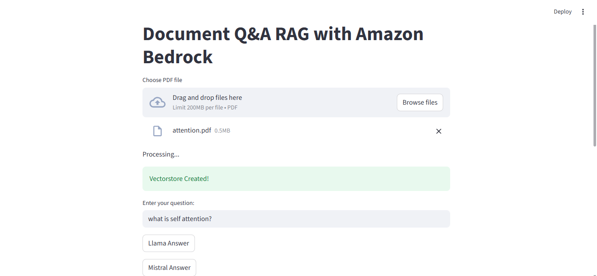
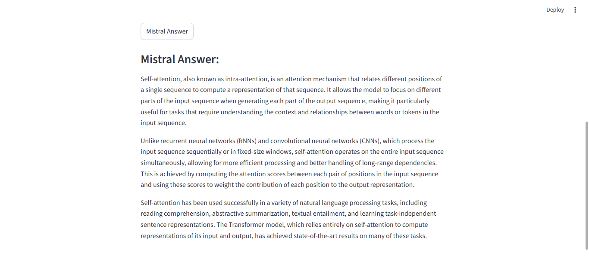

# Document Q&A with RAG using AWS Bedrock

A **Document Question-Answering (Q&A) application** leveraging **AWS Bedrock** LLM models and **LangChain** to perform **RAG (Retrieval-Augmented Generation)** over PDF documents.

---

## 🚀 Project Overview

This project allows users to upload PDF documents and ask questions. The system:
1. Splits documents into smaller chunks.
2. Generates **vector embeddings** using **Amazon Titan Embeddings**.
3. Stores vectors in **FAISS** vector store.
4. Retrieves relevant context for the user query.
5. Generates answers using **AWS Bedrock LLMs** like **Meta Llama 3** and **Mistral**.

This demonstrates **practical knowledge of AWS Bedrock, LangChain, embeddings, vector databases, and LLM-based RAG workflows**.

---

## 🛠️ Tech Stack

- **AWS Bedrock** (Meta Llama 3, Mistral)  
- **LangChain** (RAG pipeline, Chat Models, Prompts)  
- **FAISS** (Vector store for embeddings)  
- **Streamlit** (Web UI)  
- **Python** (Core implementation)

---

## 📂 Features

- Upload PDF documents.
- RAG-based retrieval of context for questions.
- Generate answers with **multiple LLMs** (Llama & Mistral).
- Configurable parameters for LLM inference (temperature, max tokens, etc.).

---

## ⚡ Usage

1. Clone the repository:

```bash
git clone https://github.com/sush-sp777/PDF-QnA-RAG-AWS-Bedrock.git
cd PDF-QnA-AWS-Bedrock
```
2. Install dependencies:
```bash
pip install -r requirements.txt
```
3. Configure AWS credentials
This project uses AWS Bedrock, so you must authenticate using the AWS CLI:
```bash
aws configure
```
Then enter the following when prompted:
- AWS Access Key ID
- AWS Secret Access Key
- Default Region (Example: us-east-1)
- Output format (press Enter to skip)
⚠️ Make sure these keys belong to an IAM user with Bedrock access.

4. Run the Streamlit app
```bash
streamlit run app.py
```

## 📸 Screenshots
1. Home Screen – PDF Upload


2. Mistral Answer Output



